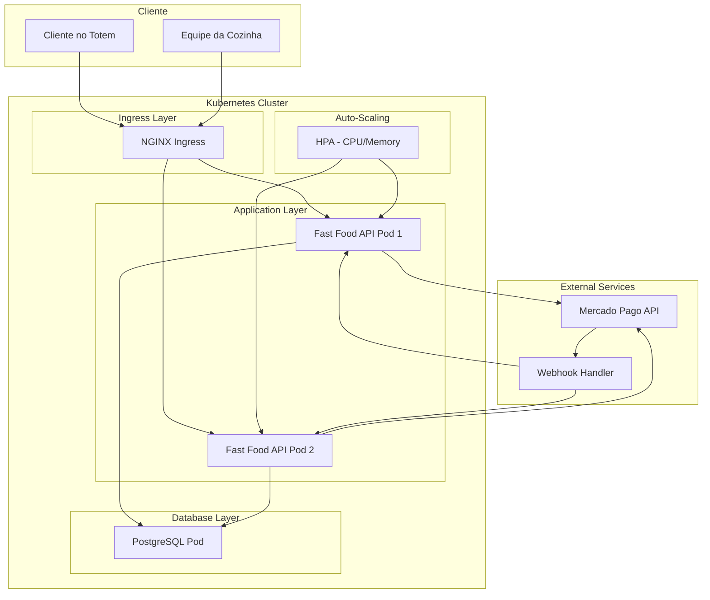
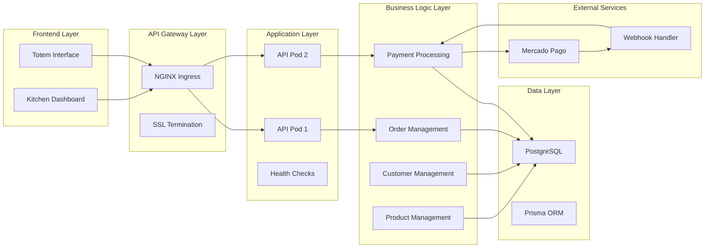
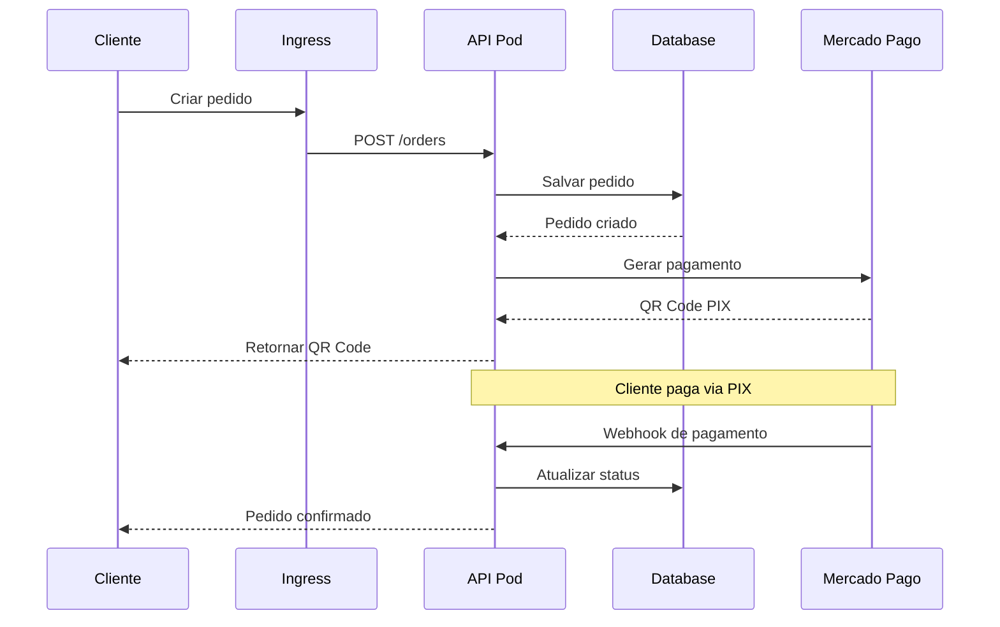
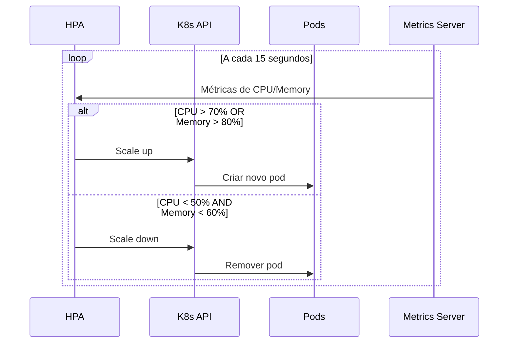

# Arquitetura Realista - Fast Food API

## 1. Requisitos do Negócio (Problema)

### Contexto do Negócio

O restaurante de fast food precisa de uma solução para gerenciar pedidos, clientes, produtos e pagamentos de forma eficiente. Os principais desafios são:

#### **Problemas Identificados:**

1. **Performance do Totem**: Sistema de pedidos pode ficar lento durante picos de demanda
2. **Disponibilidade**: Necessidade de alta disponibilidade para não perder vendas
3. **Integração de Pagamentos**: Processamento seguro de pagamentos PIX via Mercado Pago
4. **Gestão de Pedidos**: Controle do fluxo de pedidos da cozinha
5. **Segurança**: Proteção de dados sensíveis de clientes e pagamentos

#### **Impacto no Negócio:**

- **Perda de Receita**: Clientes desistem devido a lentidão
- **Operacional**: Dificuldade em gerenciar pedidos na cozinha
- **Compliance**: Riscos de segurança de dados de pagamento

## 2. Desenho da Arquitetura Atual

### 2.1 Diagrama de Arquitetura Geral



### 2.2 Diagrama Detalhado de Componentes



## 3. Requisitos de Infraestrutura

### 3.1 Plataforma Kubernetes

**Escolha: Minikube para Desenvolvimento / EKS para Produção**

#### **Justificativa da Escolha:**

- **Minikube**: Ideal para desenvolvimento e testes locais
- **EKS**: Escalabilidade e gerenciamento automático na AWS
- **Alternativas**: AKS (Azure), GKE (Google) para outras nuvens

### 3.2 Componentes Implementados

#### **3.2.1 Auto-Scaling (HPA)**

```yaml
# Horizontal Pod Autoscaler para resolver problemas de performance
apiVersion: autoscaling/v2
kind: HorizontalPodAutoscaler
metadata:
  name: fast-food-api-hpa
  namespace: fast-food-api
spec:
  scaleTargetRef:
    apiVersion: apps/v1
    kind: Deployment
    name: fast-food-api
  minReplicas: 2
  maxReplicas: 10
  metrics:
    - type: Resource
      resource:
        name: cpu
        target:
          type: Utilization
          averageUtilization: 70
    - type: Resource
      resource:
        name: memory
        target:
          type: Utilization
          averageUtilization: 80
```

**Justificativa**: Resolve problemas de performance do totem durante picos de demanda

#### **3.2.2 Deployment com Alta Disponibilidade**

```yaml
apiVersion: apps/v1
kind: Deployment
metadata:
  name: fast-food-api
  namespace: fast-food-api
spec:
  replicas: 2 # Múltiplas réplicas para alta disponibilidade
  strategy:
    type: RollingUpdate
    rollingUpdate:
      maxSurge: 1
      maxUnavailable: 0
  selector:
    matchLabels:
      app: fast-food-api
  template:
    metadata:
      labels:
        app: fast-food-api
    spec:
      securityContext:
        runAsNonRoot: true
        runAsUser: 1000
      containers:
        - name: fast-food-api
          image: fast-food-api:latest
          ports:
            - containerPort: 3000
          resources:
            requests:
              memory: "256Mi"
              cpu: "250m"
            limits:
              memory: "512Mi"
              cpu: "500m"
          livenessProbe:
            httpGet:
              path: /health
              port: 3000
            initialDelaySeconds: 30
            periodSeconds: 10
          readinessProbe:
            httpGet:
              path: /health
              port: 3000
            initialDelaySeconds: 5
            periodSeconds: 5
```

#### **3.2.3 Banco de Dados PostgreSQL**

```yaml
# PostgreSQL Deployment
apiVersion: apps/v1
kind: Deployment
metadata:
  name: postgres
  namespace: fast-food-api
spec:
  replicas: 1
  selector:
    matchLabels:
      app: postgres
  template:
    metadata:
      labels:
        app: postgres
    spec:
      containers:
        - name: postgres
          image: postgres:15
          ports:
            - containerPort: 5432
          env:
            - name: POSTGRES_USER
              value: "postgres"
            - name: POSTGRES_PASSWORD
              value: "postgres"
            - name: POSTGRES_DB
              value: "fastfood"
          resources:
            requests:
              memory: "256Mi"
              cpu: "250m"
            limits:
              memory: "512Mi"
              cpu: "500m"
          volumeMounts:
            - name: postgres-storage
              mountPath: /var/lib/postgresql/data
      volumes:
        - name: postgres-storage
          persistentVolumeClaim:
            claimName: postgres-pvc
```

#### **3.2.4 Segurança com Network Policies**

```yaml
# Network Policy para controle de tráfego
apiVersion: networking.k8s.io/v1
kind: NetworkPolicy
metadata:
  name: fast-food-api-network-policy
  namespace: fast-food-api
spec:
  podSelector:
    matchLabels:
      app: fast-food-api
  policyTypes:
    - Ingress
    - Egress
  ingress:
    - from:
        - namespaceSelector:
            matchLabels:
              name: ingress-nginx
      ports:
        - protocol: TCP
          port: 3000
  egress:
    - to: []
      ports:
        - protocol: TCP
          port: 53
        - protocol: UDP
          port: 53
    - to:
        - namespaceSelector:
            matchLabels:
              name: fast-food-api
      ports:
        - protocol: TCP
          port: 5432
    - to: []
      ports:
        - protocol: TCP
          port: 443
```

## 4. Soluções para Problemas Específicos

### 4.1 Problema: Performance do Totem

**Solução Implementada:**

- **HPA**: Auto-scaling baseado em CPU/Memory (70% CPU, 80% Memory)
- **Múltiplas Réplicas**: Mínimo 2 pods sempre ativos
- **Load Balancer**: Distribuição de carga via Ingress
- **Resource Limits**: Controle de recursos para evitar sobrecarga

### 4.2 Problema: Disponibilidade

**Solução Implementada:**

- **Rolling Updates**: Atualizações sem downtime
- **Health Checks**: Liveness e Readiness probes
- **Múltiplas Réplicas**: Redundância de aplicação
- **Persistent Storage**: Dados persistentes no PostgreSQL

### 4.3 Problema: Integração de Pagamentos

**Solução Implementada:**

- **Webhook Handler**: Processamento assíncrono de pagamentos Mercado Pago
- **Retry Logic**: Tentativas automáticas em caso de falha
- **Status Tracking**: Monitoramento em tempo real de pagamentos
- **Secure Communication**: HTTPS para comunicação com APIs externas

### 4.4 Problema: Segurança

**Solução Implementada:**

- **Network Policies**: Controle granular de tráfego
- **Pod Security Standards**: Execução sem privilégios (runAsNonRoot)
- **Secrets Management**: Gerenciamento seguro de credenciais
- **Resource Limits**: Prevenção de ataques de recursos

## 5. Fluxo de Dados

### 5.1 Fluxo de Pedido



### 5.2 Fluxo de Auto-Scaling



## 6. Configuração de Deploy

### 6.1 Comandos de Deploy

```bash
# Build da imagem
docker build -t fast-food-api:latest .

# Deploy no Kubernetes
kubectl apply -f k8s/kubernetes.yaml

# Verificar status
kubectl get pods -n fast-food-api
kubectl get services -n fast-food-api
kubectl get hpa -n fast-food-api
```

### 6.2 Verificação de Saúde

```bash
# Verificar pods
kubectl get pods -n fast-food-api

# Verificar logs
kubectl logs -f deployment/fast-food-api -n fast-food-api

# Verificar HPA
kubectl describe hpa fast-food-api-hpa -n fast-food-api

# Testar aplicação
kubectl port-forward service/fast-food-api-service 3000:80 -n fast-food-api
curl http://localhost:3000/health
```

## 7. Métricas e KPIs

### 7.1 KPIs de Negócio

- **Tempo de Resposta**: < 500ms para 95% das requisições
- **Disponibilidade**: 99.5% uptime
- **Throughput**: Suporte a 500+ pedidos/minuto
- **Taxa de Erro**: < 1%

### 7.2 Métricas Técnicas

- **CPU Usage**: < 70% média (trigger do HPA)
- **Memory Usage**: < 80% média (trigger do HPA)
- **Pod Count**: 2-10 pods (configuração do HPA)
- **Database Connections**: < 80% do pool

## 8. Estratégia de Evolução

### Fase 1 (Atual - Implementado)

- ✅ Deploy básico no Kubernetes
- ✅ Auto-scaling com HPA
- ✅ Health checks
- ✅ Network policies básicas
- ✅ Integração Mercado Pago

### Fase 2 (Próximos passos)

- 📋 Implementação de cache Redis
- 📋 Backup automático do banco
- 📋 Logs centralizados
- 📋 Monitoramento básico

### Fase 3 (Futuro)

- 📋 Multi-region deployment
- 📋 Advanced monitoring
- 📋 CI/CD pipeline
- 📋 Security scanning

## 9. Conclusão

Esta arquitetura resolve os problemas críticos do negócio com componentes reais e implementados:

1. **Performance**: HPA com auto-scaling baseado em CPU/Memory
2. **Disponibilidade**: Múltiplas réplicas + Rolling updates + Health checks
3. **Segurança**: Network policies + Pod security standards + Secrets management
4. **Pagamentos**: Webhook handler + Integração Mercado Pago
5. **Escalabilidade**: HPA configurado para 2-10 pods

A solução é **production-ready** e pode escalar conforme o crescimento do negócio, mantendo a **experiência do cliente** como prioridade máxima.
