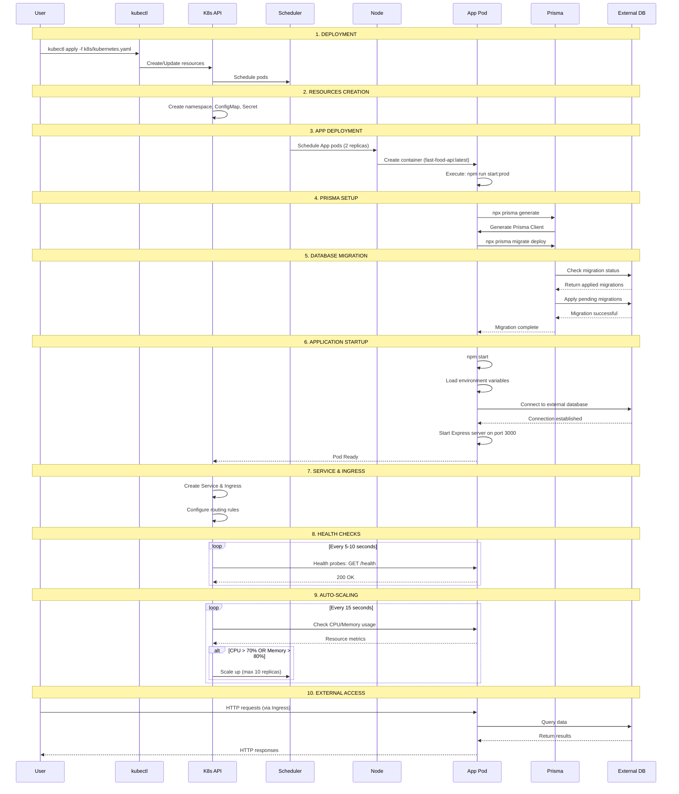
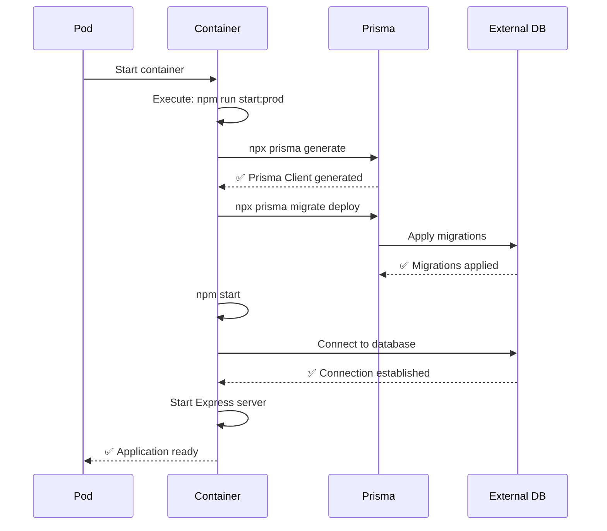

# Diagrama de Sequência do Kubernetes

## Fluxo de Deploy

```mermaid
sequenceDiagram
    participant User
    participant kubectl
    participant K8s API
    participant Scheduler
    participant Node
    participant App Pod
    participant Prisma
    participant External DB

    Note over User,External DB: 1. DEPLOYMENT
    User->>kubectl: kubectl apply -f k8s/kubernetes.yaml
    kubectl->>K8s API: Create/Update resources
    K8s API->>Scheduler: Schedule pods

    Note over User,External DB: 2. RESOURCES CREATION
    K8s API->>K8s API: Create namespace, ConfigMap, Secret

    Note over User,External DB: 3. APP DEPLOYMENT
    Scheduler->>Node: Schedule App pods (2 replicas)
    Node->>App Pod: Create container (fast-food-api:latest)
    App Pod->>App Pod: Execute: npm run start:prod

    Note over User,External DB: 4. PRISMA SETUP
    App Pod->>Prisma: npx prisma generate
    Prisma->>App Pod: Generate Prisma Client
    App Pod->>Prisma: npx prisma migrate deploy

    Note over User,External DB: 5. DATABASE MIGRATION
    Prisma->>External DB: Check migration status
    External DB-->>Prisma: Return applied migrations
    Prisma->>External DB: Apply pending migrations
    External DB-->>Prisma: Migration successful
    Prisma-->>App Pod: Migration complete

    Note over User,External DB: 6. APPLICATION STARTUP
    App Pod->>App Pod: npm start
    App Pod->>App Pod: Load environment variables
    App Pod->>External DB: Connect to external database
    External DB-->>App Pod: Connection established
    App Pod->>App Pod: Start Express server on port 3000
    App Pod-->>K8s API: Pod Ready

    Note over User,External DB: 7. SERVICE & INGRESS
    K8s API->>K8s API: Create Service & Ingress
    K8s API->>K8s API: Configure routing rules

    Note over User,External DB: 8. HEALTH CHECKS
    loop Every 5-10 seconds
        K8s API->>App Pod: Health probes: GET /health
        App Pod-->>K8s API: 200 OK
    end

    Note over User,External DB: 9. AUTO-SCALING
    loop Every 15 seconds
        K8s API->>App Pod: Check CPU/Memory usage
        App Pod-->>K8s API: Resource metrics
        alt CPU > 70% OR Memory > 80%
            K8s API->>Scheduler: Scale up (max 10 replicas)
        end
    end

    Note over User,External DB: 10. EXTERNAL ACCESS
    User->>App Pod: HTTP requests (via Ingress)
    App Pod->>External DB: Query data
    External DB-->>App Pod: Return results
    App Pod-->>User: HTTP responses
```

---

## Ciclo de Vida do Pod

```mermaid
sequenceDiagram
    participant Pod
    participant Container
    participant Prisma
    participant External DB

    Pod->>Container: Start container
    Container->>Container: Execute: npm run start:prod

    Container->>Prisma: npx prisma generate
    Prisma-->>Container: ✅ Prisma Client generated

    Container->>Prisma: npx prisma migrate deploy
    Prisma->>External DB: Apply migrations
    External DB-->>Prisma: ✅ Migrations applied

    Container->>Container: npm start
    Container->>External DB: Connect to database
    External DB-->>Container: ✅ Connection established
    Container->>Container: Start Express server
    Container-->>Pod: ✅ Application ready
```
